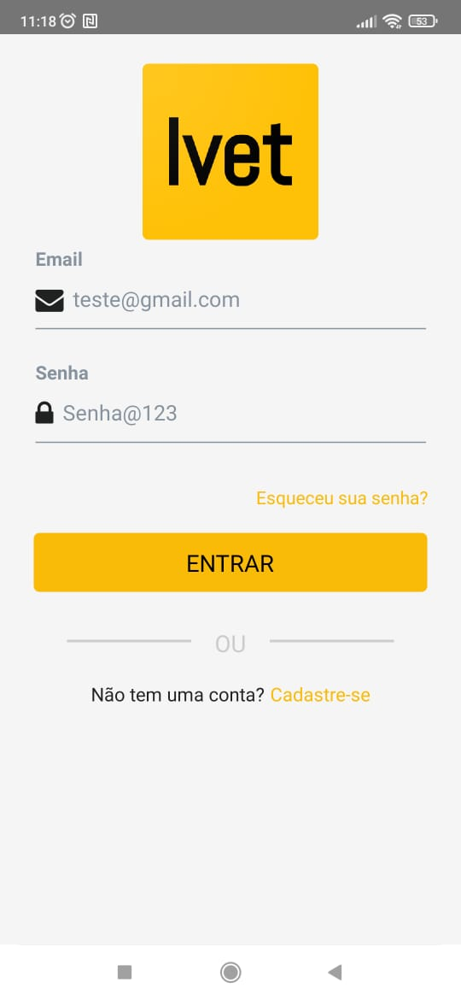
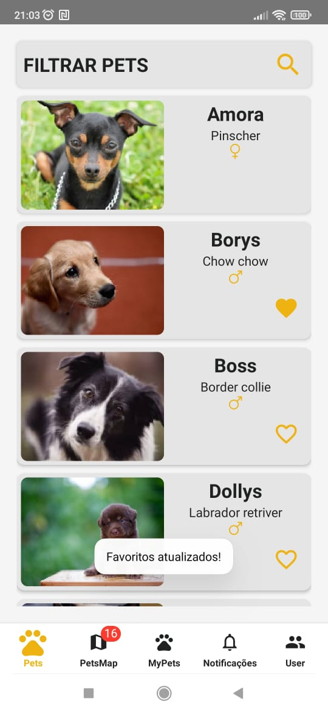
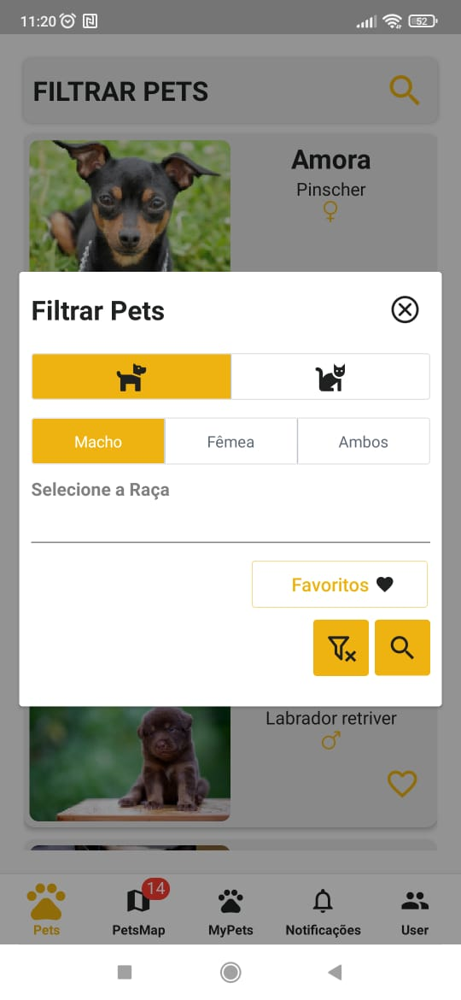
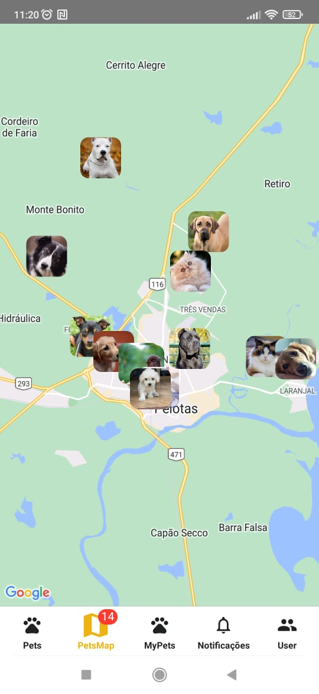
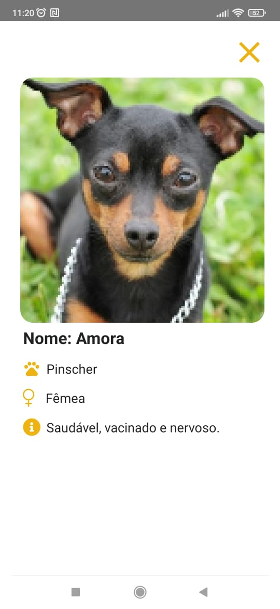
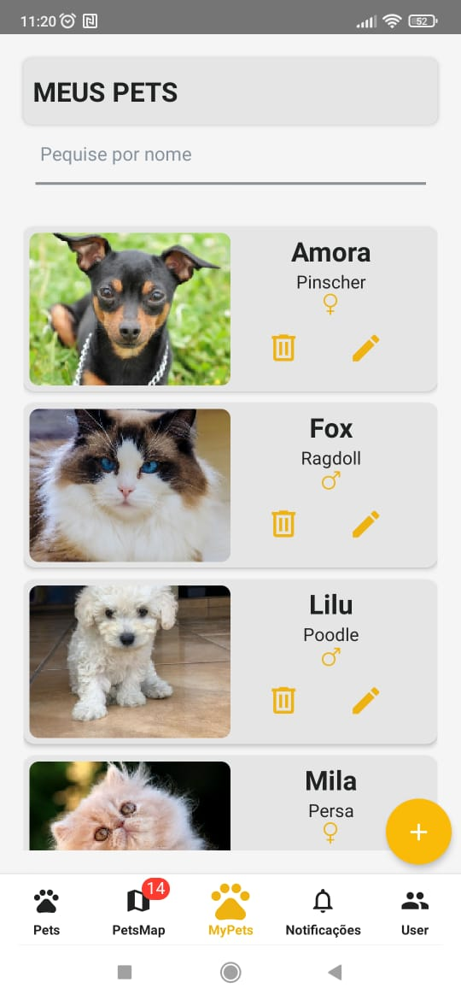
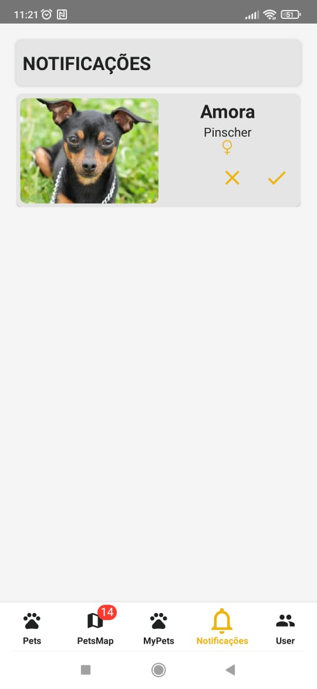

# IVET - ReactNative - Aplicativo de adoção de animais

Neste projeto foi desenvolvido uma aplicativo para adoção de animais baseado em geolocalização, com uso de filtros diversos como: sexo, tipo de pet, raça e favoritados.
Além de notificações de adoção e cadastro de Pets.

## Instalação

Baixe o projeto e rode os sequintes comandos abaixo.

Faça o git clone deste projeto.

Apos certifiquese que você tem o Node
instalado em sua máquina.

Caso não tenha o node clique no link abaixo e faça a instação.

[nodejs](https://nodejs.org/en/download)

apos siga os execute os dois comandos abaixo

```bash
  npm install
  npm run dev
```

## Como rodar o projeto

1. Certifique-se de ter o ambiente de desenvolvimento Java instalado em sua máquina.
2. Baixe e instale o Node.js em seu sistema, pois o React Native depende dele.
3. Instale o React Native CLI usando o npm (Node Package Manager).
4. Crie um novo projeto React Native executando o comando "npx react-native init nome_do_projeto".
5. Abra o projeto em um editor de código de sua escolha.
6. Inicie o emulador Android ou iOS ou conecte um dispositivo físico via USB.
7. No terminal, execute o comando "npx react-native run-android" ou "npx react-native run-ios" para iniciar o aplicativo no emulador ou dispositivo físico.

<h2>Tecnologias usadas</h2>
<ol>
    <li>react native/</li>
    <li>firebase</li>
    <li>react-native-elements</li>
    <li>react-native-image-picker</li>
    <li>react-native-maps</li>
    <li>react-native-screens</li>
    <li>styled-components</li>
    <li>apisauce</li>
</ol>

## Conheça o projeto

### Página Login



### Página Home



### Página Filtro



### Página PetsMap



### Página View Pet



### Página Meus Pets



### Página de Notificações


